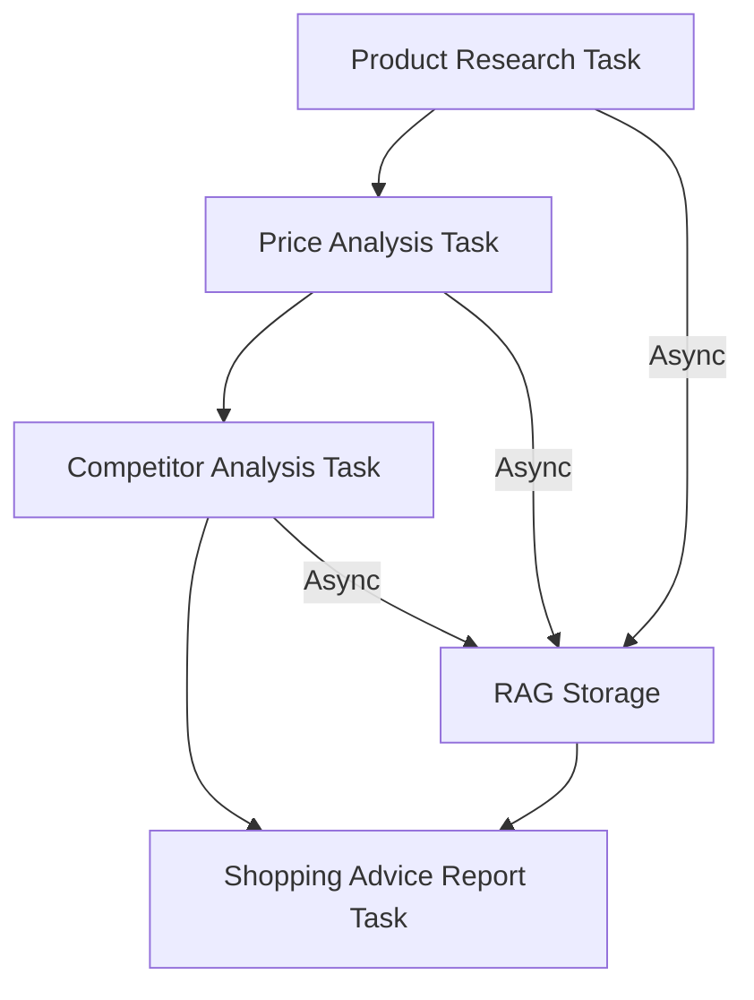

# 🛒 ShoppingAdvisorCrew Documentation

## Overview

The **ShoppingAdvisorCrew** is a specialized multi-agent system designed to provide comprehensive shopping advice through product research, price analysis, and competitor comparisons. It focuses specifically on the Swiss and French markets, delivering professional HTML reports with actionable purchasing recommendations.

## 🎯 Core Functionality

### What it does

- **Product Research**: In-depth analysis of specifications, features, pros/cons, and user reviews
- **Price Comparison**: Real-time price analysis across major retailers in Switzerland and France
- **Competitor Analysis**: Feature-by-feature comparison with alternative products
- **Professional Reports**: HTML reports with purchase recommendations and direct links

### Target Markets

- **Switzerland**: Digitec, Galaxus, Manor, Microspot, Interdiscount
- **France**: Amazon.fr, Fnac, Cdiscount, Darty, Boulanger

## 🤖 Agent Architecture

The ShoppingAdvisorCrew consists of four specialized agents working in sequence:

### 1. Product Researcher 🔍

**Role**: Deep product research and analysis

- Gathers comprehensive product specifications and features
- Analyzes user reviews and professional evaluations
- Identifies pros, cons, and common issues
- Documents warranty and support information
- **Tools**: Serper, ScrapeNinja, RAG

### 2. Price Analyst 💰

**Role**: Multi-market price comparison and analysis

- Finds current prices across major retailers in both countries
- Calculates total costs including shipping and taxes
- Analyzes price trends and seasonal variations
- Provides direct purchase links
- **Tools**: Serper, ScrapeNinja, RAG

### 3. Competitor Analyst ⚖️

**Role**: Market positioning and alternative analysis

- Identifies 3-5 main competing products
- Creates feature-by-feature comparison matrices
- Analyzes market positioning and target audiences
- Evaluates unique selling points
- **Tools**: Serper, ScrapeNinja, RAG

### 4. Shopping Advisor 📋

**Role**: Report consolidation and recommendations

- Synthesizes all research findings
- Creates professional HTML reports using ReportingTool
- Provides clear purchasing recommendations
- Generates comparison tables and actionable insights
- **Tools**: RAG, ReportingTool

## 🔄 Task Flow



### Task Execution

1. **Parallel Execution**: First three tasks run asynchronously for efficiency
2. **Knowledge Sharing**: All findings stored in RAG system for cross-agent access
3. **Final Synthesis**: Shopping advisor consolidates all data synchronously
4. **Report Generation**: Professional HTML report created using ReportingTool

## 📊 Report Structure

The generated HTML report includes:

### 1. Executive Summary

- Key product highlights
- Top recommendations
- Best value propositions

### 2. Product Overview

- Complete specifications
- Feature highlights
- Technical details

### 3. Pros & Cons Analysis

- Detailed advantages (minimum 5)
- Potential drawbacks (minimum 5)
- User experience insights

### 4. Price Comparison Tables

- **Switzerland vs France** pricing
- **Total cost analysis** (including shipping/taxes)
- **Best value recommendations** per country
- **Direct purchase links**

### 5. Competitor Comparison Matrix

- Feature-by-feature comparison
- Price positioning analysis
- Market differentiation
- Alternative recommendations

### 6. Final Recommendations

- **Best overall choice**
- **Budget-friendly option**
- **Premium alternative**
- **Country-specific recommendations**

## 🚀 Usage Examples

### Simple Product Inquiry

```
"I need shopping advice for a MacBook Pro M4"
```

### Price-Focused Query

```
"Compare prices for iPhone 15 Pro in Switzerland and France"
```

### Budget-Constrained Search

```
"Best laptop under 1500 CHF with pros and cons"
```

### Category Comparison

```
"Shopping advice for wireless headphones with competitor comparison"
```

## ⚙️ Technical Implementation

### File Structure

```
src/epic_news/crews/shopping_advisor/
├── shopping_advisor.py          # Main crew class
├── config/
│   ├── agents.yaml             # Agent configurations
│   └── tasks.yaml              # Task definitions
└── __init__.py
```

### Key Configuration

- **Process**: Sequential execution
- **Memory**: Enabled for cross-agent knowledge sharing
- **Async Execution**: First 3 tasks run asynchronously
- **Timeout**: 30 minutes maximum execution time
- **Context Window**: Respected for large data processing

### Tool Integration

- **Serper**: Web search for product information and prices
- **ScrapeNinja**: Advanced web scraping for retailer data
- **RAG**: Knowledge base for inter-agent communication
- **ReportingTool**: Professional HTML report generation

## 🔧 Configuration Details

### Agent Timeouts

- **LLM Timeout**: 300 seconds (5 minutes)
- **Max Iterations**: 25 per agent
- **Total Execution**: 1800 seconds (30 minutes)

### Output Configuration

- **Report Format**: Professional HTML with UTF-8 encoding
- **File Location**: `output/shopping_advice/shopping_report.html`
- **Email Delivery**: Automated via PostCrew integration

## 🔗 Integration Points

### Main Application Flow

- **Trigger**: User requests classified as "SHOPPING" action
- **Routing**: `main.py` → `determine_crew()` → `ShoppingAdvisorCrew`
- **Handler**: `generate_shopping_advice()` method
- **State Management**: Results stored in `ContentState.shopping_advice_report`

### Email Delivery

- **Post-Processing**: Report automatically sent via PostCrew
- **Integration**: Added to main flow's `join()` listener
- **Delivery**: Professional HTML email with attachment

## 🛡️ Quality Standards

### Research Quality

- **Minimum 20+ data points** per product
- **Multiple source verification**
- **Current year relevance** (2025)
- **Factual accuracy requirements**

### Report Quality

- **Professional HTML5 structure**
- **UTF-8 encoding** with emoji support
- **Semantic markup** and clear navigation
- **Mobile-responsive design**
- **No placeholder text or raw API responses**

### Price Accuracy

- **Real-time pricing** from verified retailers
- **Total cost calculations** including all fees
- **Direct purchase links** validation
- **Currency consistency** (CHF/EUR)

## 🎨 Design Principles Compliance

### KISS (Keep It Simple, Stupid)

- Clean, focused agent responsibilities
- Straightforward task definitions
- Simple configuration management

### DRY (Don't Repeat Yourself)

- Centralized tool initialization
- Reusable configuration patterns
- Shared knowledge via RAG system

### Configuration-Driven Design

- YAML-based agent and task definitions
- Separation of code and configuration
- Environment-based customization

### Async-First Architecture

- Parallel task execution where possible
- Non-blocking research operations
- Efficient resource utilization

## 🔍 Troubleshooting

### Common Issues

#### No Results Found

- **Cause**: Product name too generic or misspelled
- **Solution**: Use specific product model numbers

#### Price Data Missing

- **Cause**: Retailer blocking or rate limiting
- **Solution**: Automatic retry with different user agents

#### Report Generation Fails

- **Cause**: RAG data inconsistency or ReportingTool issues
- **Solution**: Check logs for specific error details

### Debug Tips

- **Verbose Logging**: Enabled by default for troubleshooting
- **Memory Usage**: Monitor for large product catalogs
- **Rate Limiting**: Built-in delays for respectful scraping

## 📈 Performance Metrics

### Expected Execution Times

- **Product Research**: 3-5 minutes
- **Price Analysis**: 5-7 minutes  
- **Competitor Analysis**: 4-6 minutes
- **Report Generation**: 1-2 minutes
- **Total Average**: 13-20 minutes

### Resource Usage

- **Memory**: Moderate (RAG storage)
- **API Calls**: High (research-intensive)
- **Network**: Intensive (multiple retailer queries)

## 🔄 Future Enhancements

### Planned Features

- **Additional Markets**: Germany, Italy expansion
- **Price Alerts**: Historical price tracking
- **Wishlist Management**: Save and monitor products  
- **Review Sentiment**: AI-powered review analysis
- **Stock Monitoring**: Availability tracking across retailers

### Technical Improvements

- **Caching**: Redis-based price caching
- **Parallel Markets**: Simultaneous country analysis
- **ML Models**: Price prediction algorithms
- **API Integration**: Direct retailer APIs where available

---

*For more information about the Epic News system, see the main [documentation](./README.md) and [design principles](./DESIGN_PRINCIPLES.md).*
